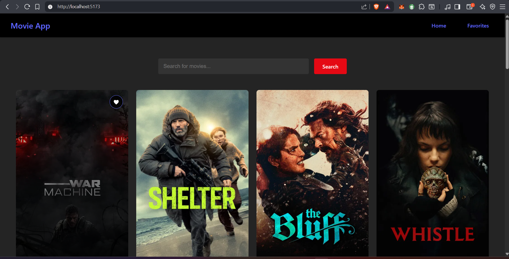
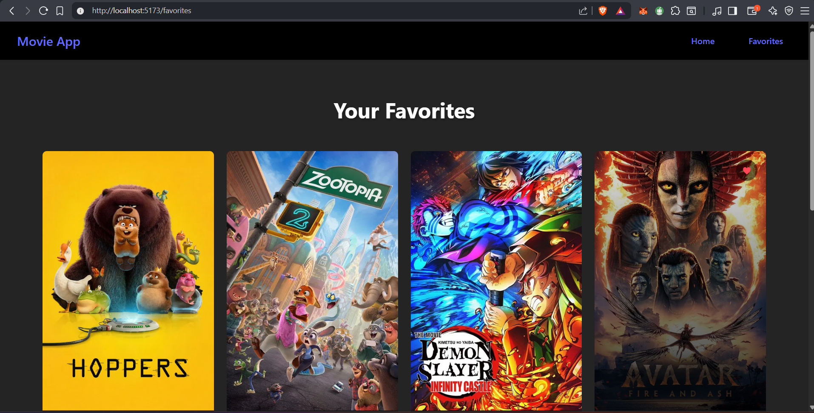

# 🎬 React Movie App

A simple movie browsing application built with **React** that allows users to search for movies and save their favorites.

## 🚀 Features

* 🔎 **Search Movies** – Search for movies using a movie API.
* 🏠 **Home Page** – Browse and search for movies.
* ❤️ **Favorites Page** – Save and manage your favorite movies.
* 📱 **Responsive UI** – Clean and modern movie card layout.
* ⚡ **Fast React UI** – Built with modern React features.

---

## 🖼️ Pages

### Home Page

* Displays movie results.
* Users can search for movies using the search bar.
* Each movie card includes a **favorite button** to add or remove movies from favorites.




### Favorites Page

* Displays all movies that the user has added to their favorites.
* Allows users to remove movies from the favorites list.



---

## 🛠️ Tech Stack

* **React**
* **JavaScript (ES6+)**
* **CSS**
* **Vite**
* **TMDB Movie API**

---

## 📦 Installation

Clone the repository:

```bash
git clone https://github.com/your-username/react-movie-app.git
```

Navigate into the project folder:

```bash
cd react-movie-app
cd movie-app
```

Install dependencies:

```bash
npm install
```

Start the development server:

```bash
npm run dev
```

The app will run at:

```
http://localhost:5173
```

---

